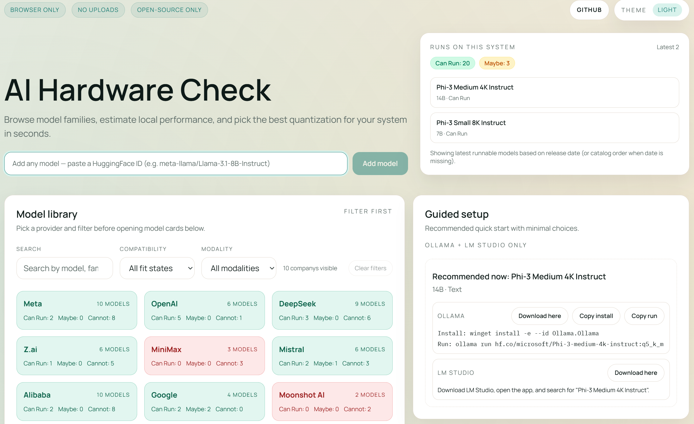

# AI Hardware Check

A browser-only tool that detects your system hardware and estimates which open-source AI models you can run locally — no uploads, no accounts, no backend.



## Features

- **Model library** — curated catalog of 40+ model families (Meta, Mistral, DeepSeek, Qwen, Google, and more), grouped by provider and family
- **Guided setup assistant** — choose your goal (chat, coding, vision, offline) and deployment style (local app, CLI, hosted API) to get a plain-language next step
- **Add any model** — paste a HuggingFace repo ID and the app fetches parameter count, modality, and provider automatically, then groups it alongside the built-in catalog
- **RAM fit estimation with reasoning** — compares your RAM against quant requirements and explains why each quant is a good, borderline, or bad fit
- **Confidence-scored hardware profiling** — reports not only specs, but also source quality (reported vs measured), unresolved gaps, and an inferred performance tier
- **Performance range estimation** — predicts a conservative-to-expected token/s range plus first-token latency instead of a single optimistic value
- **Quantization table** — every quant row links directly to the HuggingFace repo or a pre-filled search for community GGUF downloads
- **System hardware snapshot** — CPU threads, RAM, GPU renderer, WebGL / WebGPU status, all from browser APIs
- **Search & filters** — filter by provider, compatibility status, or modality; full-text search across model names, families, and repo IDs
- **Dark / light theme** — persisted to `localStorage`
- **100 % client-side** — no server, no data collection

## Quick Start (Docker Hub)

```bash
# Pull and run in one step
docker run --rm -p 38421:80 gptvibe/ai-hardware-check
```

Then open <http://localhost:38421>.

### docker-compose

```bash
# Clone the repo and run with compose
git clone https://github.com/gptvibe/AI-Hardware-Check.git
cd AI-Hardware-Check
docker compose up -d
```

By default, compose exposes the app on port `38421`.
To use a different port:

```bash
HOST_PORT=40123 docker compose up -d
```

## Local Development

```bash
git clone https://github.com/gptvibe/AI-Hardware-Check.git
cd AI-Hardware-Check
npm install
npm run dev        # http://localhost:5173
```

## Production Build

```bash
npm run build      # output in dist/
npm run preview    # serve the built output locally
```

## Docker (build from source)

```bash
docker build -t ai-hardware-check .
docker run --rm -p 38421:80 ai-hardware-check
```

Use any host port you want by changing the left side of `-p`, for example:

```bash
docker run --rm -p 40123:80 ai-hardware-check
```

## Adding Models

Click the input bar at the top of the page and paste any public HuggingFace repo ID, for example:

```
Qwen/QwQ-32B
mistralai/Mistral-Small-3.2-24B-Instruct-2506
google/gemma-3-27b-it
```

The app fetches the safetensors parameter count and pipeline tag, derives the provider from the org prefix, estimates RAM requirements, and persists the entry in `localStorage` across reloads. Custom models can be removed from the detail panel.

## Model Catalog

Models are stored in `public/models.json`. Each entry supports:

| Field | Description |
|---|---|
| `name` | Display name |
| `provider` | Company / org (used for grouping) |
| `family` | Model family name (optional, defaults to `name`) |
| `parameter_count` | e.g. `8B`, `70B`, `1T` |
| `huggingface_repo` | `org/model-name` |
| `modalities` | `["Text"]`, `["Image","Text"]`, etc. |
| `formats` | Quantization formats available |
| `ram_requirements_gb` | Optional overrides per quant key |
| `active_params_b` | Active parameters in billions for MoE-aware speed estimates (optional) |
| `context_windows` | Supported context lengths, e.g. `[4096, 8192, 32768]` (optional) |
| `runtime_recipe_templates` | Optional command templates for `ollama`, `lmstudio`, `llamacpp` |
| `release_date` | ISO date string for recency sorting (optional) |
| `quant_download_links` | Explicit download URLs per quant key (optional) |
| `notes` | Short note shown in the UI (optional) |

RAM is auto-estimated from `parameter_count` when `ram_requirements_gb` is not provided.

The app also supports an optional 20-second local calibration benchmark to improve token/s prediction ranges for your specific machine.

## License

MIT

